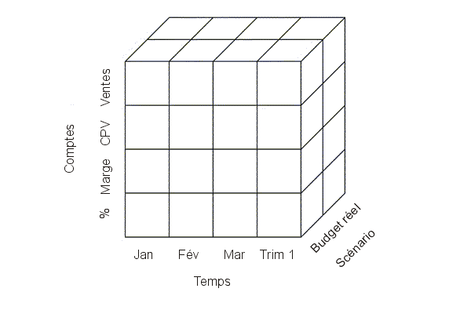
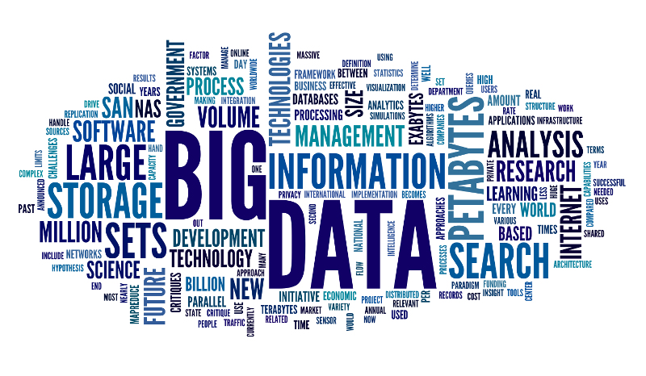
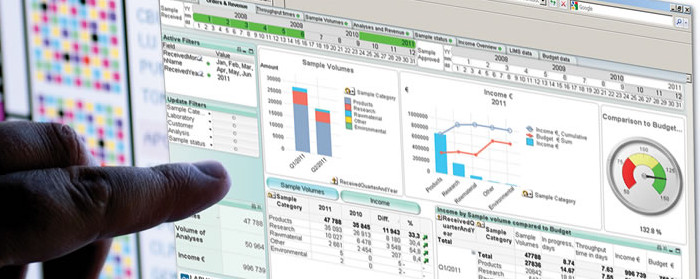
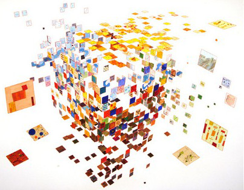

class: center, middle

# Fouille de grosses données et extraction de connaissances
### Sébastien NEDJAR (MCF AMU - LIF)
---

##Thèmes de recherches
- Bases de données multidimensionnelles,

- Entrepôt de données,

- Fouille de données,

- Extraction des connaissances.
.center[]
---

##Informatique décisionnelle (BI) ?
- Statistique descriptive,

- Données à forte densité,

- Grande Volumétrie mais faible dimensionnalité, 

- Mesurer des phénomènes, 

- Détecter des tendances.

.center[]
---

##Informatique décisionnelle (BI) ?
.center[]
---

##Informatique décisionnelle (BI) ?
.center[]
---

##Big Data ?
.center[]
---

##Big Data ?
- Statistique inférentielle, 

- Données à faible densité, 

- Grande Volumétrie et forte dimensionnalité,

- Utilisation de la volumétrie pour inférer,

- Capacité prédictive.

.center[]
---

##Big Data ?
.center[]
---

##Big Data ?
.center[]
---

##Limite actuelle du Big Data ?
Les outils utilisés à l’heure actuelle ne sont pas encore en adéquation avec les volumes de données engendrés dans l’exploration de big data. 

.center[]
---

##Limite actuelle du Big Data ?
L'enjeu principal pour l'informaticien est de concevoir des instruments permettant de mieux visualiser, analyser, et cataloguer les ensembles de données 
afin de permettre une optique de recherche guidée par la donnée.
.center[]
---

##Big Data s'oppose-t-il au BI ?
- La grande dimensionnalité dilue les connaissances dans d'immenses océans de bruits.

- Comment trouver les frontières des poches de connaissances de valeur ?

- Comment analyser à posteriori la valeur de la prédiction ?

.center[]
---

## Data mining et analyse multidimensionnelle 
- Les algorithmes de data mining visent à extraire des connaissances cachées profondément dans les données.

- Ces nouvelles connaissances nécessitent une analyse pour en comprendre les causes.

- Cette analyse multi-factorielle et multidimensionnelle est à la base des outils de BI
.center[]
---

## Deux exemples d'application
.center[]
---

## Recherche de signatures de défaut en microélectronique
 - En micro-électronique, la fabrication de composants est un processus industriel complexe.
 
 - Chaque étape du processus est susceptible d’engendrer des composants défectueux.
 
 - Pour les détecter au plus tôt, de très nombreux tests sont effectués.
 
 - Que ce soit pour prédire les défaillances ou en analyser les origines, des algorithmes de recherche multidimensionnel d'outliers (valeurs atypiques, données erronées ,signaux faibles) ont facilité ce travail.
.center[]  
---

## Détection des renversements de tendances pour la pharmacovigilance
- En pharmacovigilance on cherche à évaluer les effets indésirables résultant de l'usage des médicaments.

- Actuellement la détection repose principalement sur les médecins (obligation réglementaire). 

- L'établissement de la causalité est possible uniquement si elle est évidente et immédiate.

- L'affaire du Mediator est l'exemple le plus patent des limites du système actuel de la pharmacovigilance.

.center[]   
---

## Détection des renversements de tendances pour la pharmacovigilance
- Les laboratoires d'analyse médicale font transiter de nombreux résultats d'analyse biologique par des tiers pour les acheminer jusqu'au médecins.

- Ces tiers peuvent procéder à des analyses au fil de l'eau pour trouver en temps réelle les grandes tendances.

- Quand une tendance devient identifiable avec les outils classiques d'informatique décisionnel, il est trop tard pour réagir.

- Avec des méthodes d'apprentissage et des algorithmes d'extraction des renversement de tendances, on essaye d'isoler les phénomènes au plus tôt. 

- Une fois les phénomènes isolés, l'outil permet au spécialiste de comprendre le plus petit ensemble de facteurs significatifs.   
---

## Conclusion
- L'émergence du phénomène Big Data a apporté un nouvel éclairage aux travaux d'analyse de données.

- La profusion de données non encore exploitable est une mine d'or pour le chercheur en data mining.

- Il y a encore de nombreuses questions d'éthiques, législatives ou d'usage.

.center[]